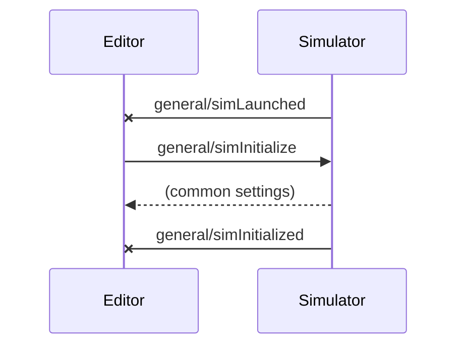
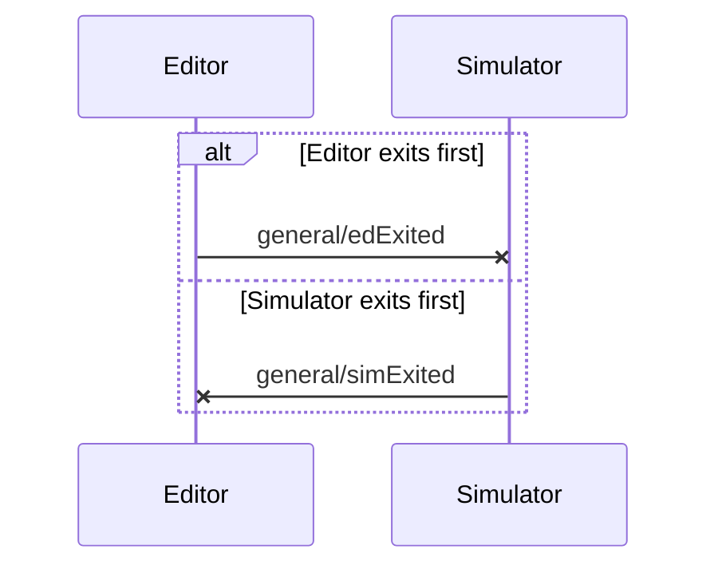
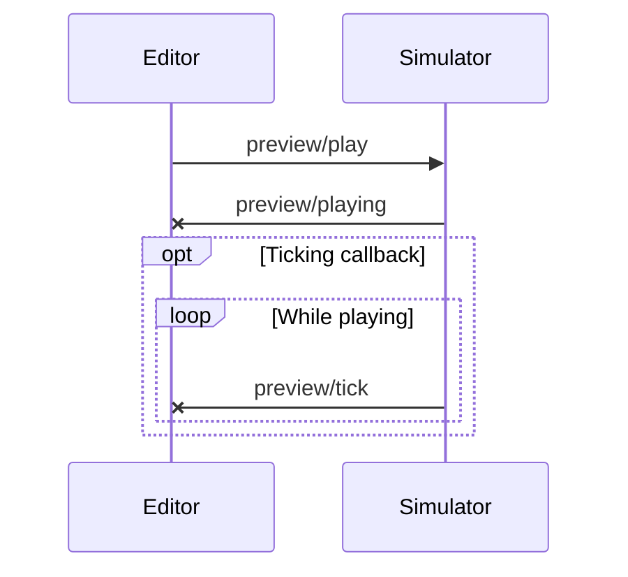
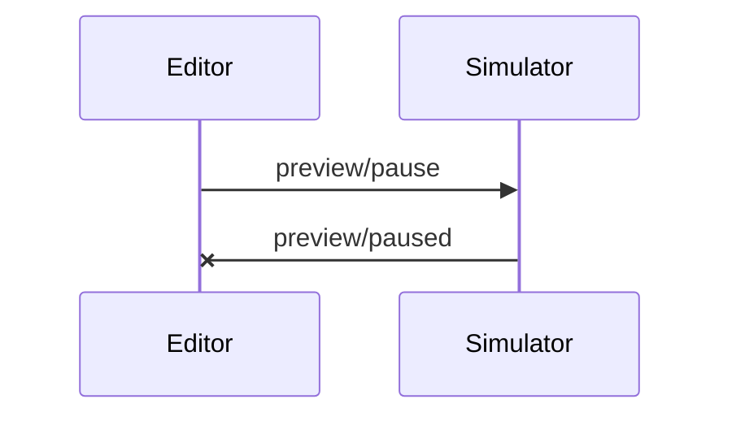
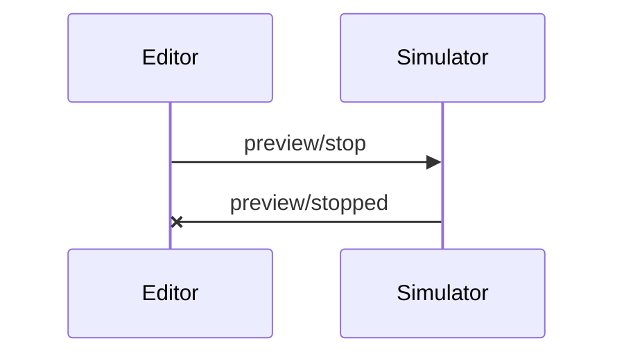
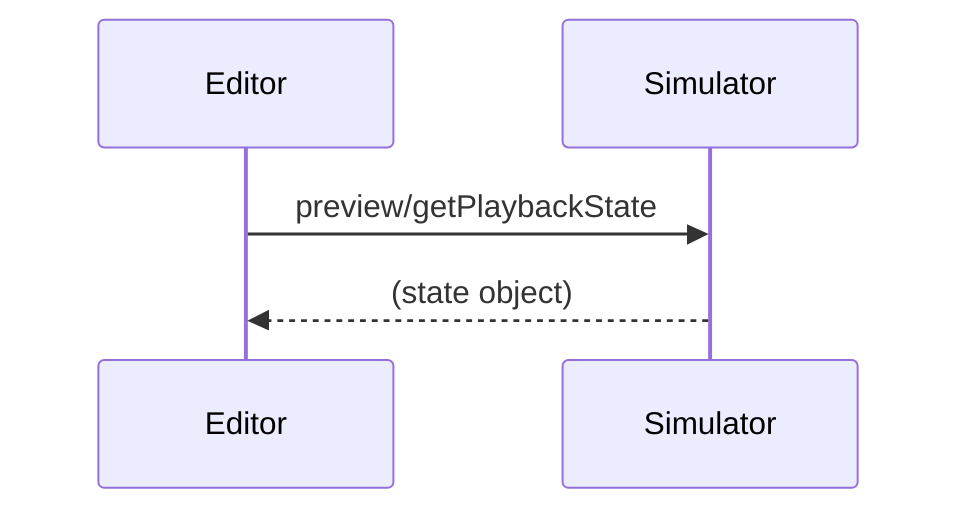
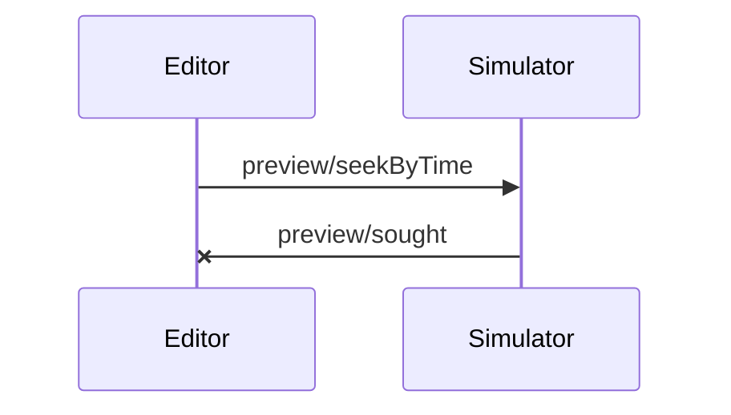
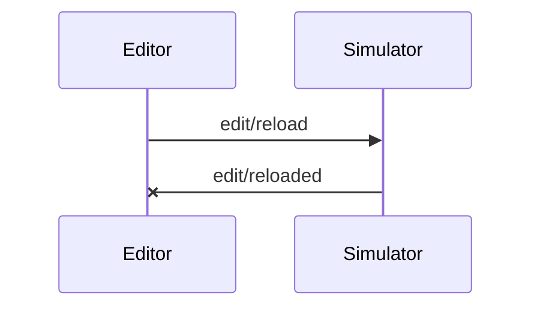

# Specification for Beatmap Visualization Server Protocol (Draft)

version 1.0

**Table of Contents**

<!-- TOC depthFrom:2 orderedList:false -->

- [Introduction](#introduction)
- [Life Cycle](#life-cycle)
    - [Initialization Stage](#initialization-stage)
    - [Working Stage](#working-stage)
    - [Finalization Stage](#finalization-stage)
- [Base Protocol](#base-protocol)
    - [HTTP Message](#http-message)
        - [Header Part](#header-part)
        - [Content Part](#content-part)
    - [Timeout](#timeout)
- [Base JSON Objects](#base-json-objects)
    - [`Message`](#message)
    - [`RequestMessage`](#requestmessage)
    - [`ResponseMessage`](#responsemessage)
    - [Notification Message](#notification-message)
    - [Specific Requests and Notifications](#specific-requests-and-notifications)
- [Methods](#methods)
    - [`general/simLaunched`](#generalsimlaunched)
    - [`general/simInitialize`](#generalsiminitialize)
    - [`general/simExited`](#generalsimexited)
    - [`general/edExited`](#generaledexited)
    - [`preview/play`](#previewplay)
    - [`preview/playing`](#previewplaying)
    - [`preview/tick`](#previewtick)
    - [`preview/pause`](#previewpause)
    - [`preview/paused`](#previewpaused)
    - [`preview/stop`](#previewstop)
    - [`preview/stopped`](#previewstopped)
    - [`preview/getPlaybackState`](#previewgetplaybackstate)
    - [`preview/seekByTime`](#previewseekbytime)
    - [`preview/sought`](#previewsought)
    - [`edit/reload`](#editreload)
    - [`edit/reloaded`](#editreloaded)

<!-- /TOC -->

---

## Introduction

TBD

Unlike LSP, relations of editors and simulators in BVSP are more closed to peer-to-peer, rather than static client-server.

Like debugging software, simulators can run in standalone mode, or be launched by editors. In the first case, there is no need to connect to an editor. In the second case, the editor always starts a server, the simulator connects to it, then starts its own server: the editor-simulator communication works in a duplex way.

The editor and the simulator are two independent applications, which implies simulator applications must provide a command line parameter that accepts a server URI, so the simulator can be informed about the URI the editor is listening to. One editor instance is only required to communicate with one simulator instance.

## Life Cycle

In a complete life cycle, there are 3 stages:

1. Initialization;
2. Working;
3. Finalization.

*\* For a better reading experience of this section, you can use a Markdown renderer with [Mermaid](https://github.com/knsv/mermaid) support, for example, VS Code with Mermaid extension installed.*

### Initialization Stage

The editor always launches first. At a specific time point, it launches a simulator instance. Then the initialization stage begins. In this stage, the simulator instance performs its initialization (the editor is already initialized), then the editor and the simulator confirm a common setting which will be used in the whole current life cycle.

Note that notifications are considered as asynchronous operations (an arrow with a cross near its head).

The sequence diagram of initialization is as follows:



### Working Stage

This is the main stage that the editor and the simulator is in. Most of the operations (reloading, previewing, etc.) happens in this stage. Since their flows vary, sequence graphs will be found at the corresponding method in [Methods](#methods) section.

### Finalization Stage

The editor or the simulator is shut down by the user manually. The first one that exits sends a notification, and the other one continues to work in *standalone* mode. The standalone mode may differ between the editor and the simulator.

The sequence diagram of finalization is as follows:



## Base Protocol

Similar to LSP, BVSP is based on [JSON-RPC 2.0 protocol](http://www.jsonrpc.org/specification).

Servers are required to handle HTTP 1.1 sessions. Requests are raised with `POST` method.

### HTTP Message

#### Header Part

Header part is encoded in ASCII.

| Header Field Name | Value Type | Description |
|---|---|---|
| Content-Length | number | The length of the content part in bytes. This header is required. |
| Content-Type | string | The MIME type of the content part. Defaults to `application/jsonrpc-bvsp; charset=utf-8` |

#### Content Part

The encoding of content part is specified in `Content-Type` header. Currently UTF-8 is the only supported encoding. As LSP suggests, you should use `utf-8` instead of `utf8`.

### Timeout

TBD

Considering that BVSP communications usually happen on the same host, the network delay is relatively low. Therefore, the default timeout is 2 seconds.

## Base JSON Objects

### `Message`

General message is defined in JSON-RPC as below:

```ts
interface Message {
    jsonrpc: string;
}
```

### `RequestMessage`

Message for requests:

```ts
interface RequestMessage extends Message {
    id: number | string | null;
    method: string;
    params?: any[];
}
```

Examples:

```json
{
    "jsonrpc": "2.0",
    "method": "method1",
    "params": [{}],
    "id": null
}

[{
    "jsonrpc": "2.0",
    "method": "method2",
    "params": null,
    "id": "id2"
}]
```

### `ResponseMessage`

Message for responses:

```ts
interface ResponseMessage extends Message {
    id: number | string | null;
    result?: any;
    error?: ResponseError<any>;
}
```

Particularly, the actual type of the response corresponds to the request. The response will be an array if the request is an array, and element orders are maintained.

The `result` field may be omitted if an error ocurred. In this case, the `error` field will have a value to describe the error.

`ResponseError` is defined as:

```ts
interface ResponseError<TData> {
    code: number;
    message: string;
    data?: TData;
}
```

Standard error codes:

```ts
export namespace ErrorCodes {
    // Defined by JSON RPC
    export const ParseError: number = -32700;
    export const InvalidRequest: number = -32600;
    export const MethodNotFound: number = -32601;
    export const InvalidParams: number = -32602;
    export const InternalError: number = -32603;
    export const ServerError_Start: number = -32099;
    export const ServerError_End: number = -32000;
    export const ServerNotInitialized: number = -32002;
    export const UnknownErrorCode: number = -32001;
}
```

Examples:

```json
{
   "jsonrpc": "2.0",
   "result": {
       "value1": 0
   },
   "id": null
}

[{
   "jsonrpc": "2.0",
   "result": [{
       "value2a": 1
   }, {
       "value2b": 2
   }],
   "id": "id2"
}]

[{
   "jsonrpc": "2.0",
   "error": {
       "code": -32001,
       "message": "A New Error"
   },
   "id": "id2"
}]
```

### Notification Message

```ts
interface NotificationMessage extends Message {
    method: string;
    params?: any[];
}
```

### Specific Requests and Notifications

Requests and notifications whose methods start with `$/` are messages which are protocol implementation-dependent and might not be implementable or supported in all editors or simulators. For example, asynchronous actions (LSP's `$/cancelRequest`), game-specific methods (`$/game/deresute/preview/seekByMeasure`), etc. Each of game-specific methods' games should have a separate specification document.

## Methods

A summary table of common command methods are listed below. "S" stands for simulators; "E" stands for editors.

| Name | Type | Category | Flow | Description |
|---|---|---|---|---|
| `general/simLaunched` | Notification | General | S→E→(S) | TBD |
| `general/simInitialize` | Request | General | E→S→E | TBD |
| `general/simExited` | Notification | General | S→E→(S) | TBD |
| `general/edExited` | Notification | General | E→S→(E) | TBD |
| `preview/play` | Request | Previewing | E→S→E | TBD |
| `preview/playing` | Notification | Previewing | S→E→(S) | TBD |
| `preview/tick` | Notification | Previewing | S→E→(S) | TBD |
| `preview/pause` | Request | Previewing | E→S→E | TBD |
| `preview/paused` | Notification | Previewing | S→E→(S) | TBD |
| `preview/stop` | Request | Previewing | E→S→E | TBD |
| `preview/stopped` | Notification | Previewing | S→E→(S) | TBD |
| `preview/getPlaybackState` | Request | Previewing | E→S→E | TBD |
| `preview/seekByTime` | Request | Previewing | E→S→E | TBD |
| `preview/sought` | Notification | Previewing | S→E→(S) | TBD |
| `edit/reload` | Request | Editing | E→S→E | TBD |
| `edit/reloaded` | Notification | Editing | S→E→(S) | TBD |
| TBD | TBD | TBD | TBD | TBD |

### `general/simLaunched`

After the simulator is launched, it starts to initialize. When its internal initialization is complete, the simulator sends an `general/simLaunched` notification to inform the editor that it is ready to handle RPC commands. The simulator must report the URI it is listening to in the parameters. Therefore, the editor should only call the simulator after it received this notification.

The sequence graph was shown in [Life Cycle](#life-cycle) section.

Parameter list:

1. `GeneralSimLaunchedNotificationParameter`

```ts
interface GeneralSimLaunchedNotificationParameter {
    // The URI that it is listening to. It is usually "http://localhost:$PORT".
    server_uri: string;
}
```

### `general/simInitialize`

After the editor receives a `general/simLaunched` notification, it sends `general/simInitialize` request to begin basic settings exchange.

The sequence graph was shown in [Life Cycle](#life-cycle) section.

Parameter list:

1. `GeneralSimInitializeRequestParameter`

```ts
interface GeneralSimInitializeRequestParameter {
}
```

Response object: `GeneralSimInitializeResponseObject`

```ts
interface GeneralSimInitializeResponseObject {
}
```

### `general/simExited`

When the user quits the simulator, such as pressing the close button, the simulator first tries to send a `general/simExited` notification, then continues shutdown. When the editor receives this notification, it should terminates current communication and stops sending requests or notifications to the simulator.

However, if a new simulator instance is launched, the editor can establish a communication with the new instance. It does not need to abandon all future communications.

The sequence graph was shown in [Life Cycle](#life-cycle) section.

Parameter list: (empty)

### `general/edExited`

When the user quits the editor, it sends a `general/edExited` notification, then continues shutdown. When the simulator receives this notification, it should terminates current communication and stops sending requests or notifications to the editor.

Since in BVSP the simulator is always the one which is launched, after the communication terminates the simulator does not need to quit. But it should be intact and only works locally (i.e. you do not expect active BVSP communications happen on this simulator instance).

The sequence graph was shown in [Life Cycle](#life-cycle) section.

Parameter list: (empty)

### `preview/play`

The editor sends `preview/play` request to let the simulator starts playing.

Note that in current version (1.0) this method's parameter body is empty so it does not carry a state. In other words, the playback always starts at *current position*, which is maintained by the simulator. If you want to start at a specific position, you should use [`preview/seekByTime`](#previewseekbytime) in combination with this method.



Parameter list:

1. `PreviewPlayRequestParameter`

```ts
interface PreviewPlayRequestParameter {
}
```

Response object: TBD

### `preview/playing`

After the playback starts, the simulator sends a `preview/playing` notification to inform the editor that the playback has started.

The sequence graph was shown in the description of [`preview/play`](#previewplay).

Parameter list: (empty)

### `preview/tick`

While the playback is in progress, the simulator sends `preview/tick` notification at a fixed step to inform the editor about current progress, etc.

The sequence graph was shown in the description of [`preview/play`](#previewplay).

Parameter list: TBD

### `preview/pause`

The editor sends a `preview/pause` request to let the simulator pauses playback.



Parameter list:

1. `PreviewPauseRequestParameter`

```ts
interface PreviewPauseRequestParameter {
}
```

Response object: TBD

### `preview/paused`

After the playback is paused, the simulator sends a `preview/paused` notification to inform the editor that the playback has been paused.

The sequence graph was shown in the description of [`preview/pause`](#previewpause).

Parameter list: (empty)

### `preview/stop`

The editor sends a `preview/stop` request to let the simulator stops playback. After the playback is stopped, its position should be set to zero.



Parameter list:

1. `PreviewStopRequestParameter`

```ts
interface PreviewStopRequestParameter {
}
```

Response object: TBD

### `preview/stopped`

After the playback stops or is stopped, the simulator sends a `preview/stopped` notification to inform the editor that the playback has stopped.

The sequence graph was shown in the description of [`preview/stop`](#previewstop).

Parameter list: (empty)

### `preview/getPlaybackState`

The editor sends a `preview/getPlaybackState` request to retrieve the simulator's playback state.



Parameter list:

1. `PreviewGetPlaybackStateRequestParameter`

```ts
interface PreviewGetPlaybackStateRequestParameter {
}
```

Response object: TBD

```ts
interface PreviewGetPlaybackStateResponseObject {
    // State enum.
    state: PlaybackState;
    // Current time, in seconds.
    time: number;
}

const enum PlaybackState {
    Unknown = 0,
    Stopped = 1,
    Playing = 2,
    Paused = 3,
    Seeking = 4,
}
```

### `preview/seekByTime`

The editor sends a `preview/seekByTime` request to let the simulator to seek to a specified time point.

Beatmaps often contains measures, but not all rhythm games have such a concept. Therefore, only a standard "by time" method is required to be implemented; other seeking methods are considered as extensions, and they will be [specific](#specific-requests-and-notifications).



Parameter list:

1. `PreviewSeekByTimeRequestParameter`

```ts
interface PreviewSeekByTimeRequestParameter {
    // Time, in seconds.
    time: number;
}
```

Response object: TBD

### `preview/sought`

After any seeking operation completes, the simulator sends a `preview/sought` notification to inform the editor that the last seeking operation is finished.

In other words, the editor should not begin another seeking process until the last one is complete.

Please note that the word used here is *sought*, not *seeked* (nonstandard) which is used in [MSE events](https://html.spec.whatwg.org/multipage/media.html#event-media-seeked).

The sequence graph was shown in the description of [`preview/seekByTime`](#previewseekbytime).

Parameter list: (empty)

### `edit/reload`

The editor sends an `edit/reload` request to let the simulator totally reloads the beatmap, and other media elements (if any). After reloading, the playback always stops.



Parameter list:

1. `EditReloadRequestParameter`

```ts
interface EditReloadRequestParameter {
    // Path to the beatmap document file.
    beatmap_file: string;
    // Index of the actual beatmap, if there are multiple beatmaps in one document.
    beatmap_index: number;
    // Extra offset for previewing, in seconds.
    beatmap_offset: number;

    // # Extensions; there may be other extensions.
    
    // Path to the background music file.
    background_music_file: string;
    // Path to the background video file.
    background_video_file: string;
}
```

Response object: TBD

### `edit/reloaded`

After the new beatmap is completely reloaded, the simulator sends an `edit/reloaded` to inform the editor that other actions, such as previewing actions, are now available.

The sequence graph was shown in the description of [`edit/reload`](#editreload).

Parameter list: (empty)
